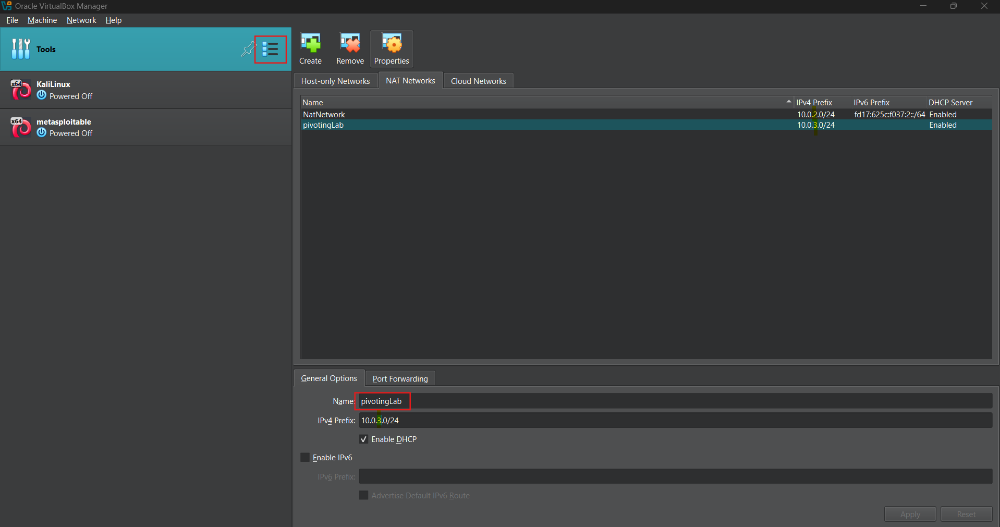
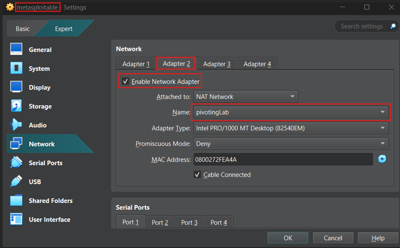

# Setting Up a Pivoting Home Lab

## Introduction

Pivoting is an essential skill in penetration testing, allowing attackers to move laterally within a compromised network to access systems that are not directly reachable. This guide walks through setting up a simple virtual lab to practice pivoting techniques using tools like Metasploit and basic networking configuration. The goal is to simulate a realistic internal network scenario where an attacker must rely on a pivot point to access deeper targets.

---

## Lab Topology Overview

We're going to build a lab that consists of:

- **Attacker Machine** (e.g., Kali Linux)
- **Pivot Machine** (e.g., Metasploitable)
- **Two Internal Target Machines** (e.g., Windows 7 and Metasploitable 2)

These machines are set up in two separate virtual networks:

- **External Network (NAT)** — where the attacker and the pivot machine reside
- **Internal Network (Host-only or NAT)** — only accessible by the pivot machine and internal targets

This setup simulates a scenario where an attacker must compromise the pivot machine first, then use it to reach internal systems.

---

## Lab Setup

### a) Create an Isolated Network (e.g., NAT Network)

---

### b) Configure the Pivot Machine

In your virtualization platform (e.g., VirtualBox), configure the pivot machine:

- Adapter 1: NAT or Bridged (connects to the attacker)
- Adapter 2: Host-only or NAT network (connects to internal targets)

---

### c) Configure Internal Target Machines

Configure Windows 7 and Metasploitable 2 with a single network adapter:

- Connect each to the **same internal network** as the pivot machine’s second adapter.
- These machines **should not be reachable** directly by the attacker.

---

### d) Networking Configuration

| Machine              | Interface | IP Address   |
|----------------------|-----------|--------------|
| **Attacker (Kali)**  | eth0      | 10.0.2.9     |
|                      | eth1      | (none)       |
| **Pivot**            | eth0      | 10.0.2.10    |
|                      | eth1      | 10.0.3.6     |
| **Windows 7 Target** | eth0      | 10.0.3.4     |
|                      | eth1      | (none)       |

---

## Test Connectivity

Test if each machine can communicate with the expected hosts:

- ✅ From **Attacker → Pivot**: `ping 10.0.2.10` — should work
- ❌ From **Attacker → Internal Target**: `ping 10.0.3.4` — should **fail**
- ✅ From **Pivot → Attacker**: `ping 10.0.2.9` — should work
- ✅ From **Pivot → Internal Target**: `ping 10.0.3.4` — should work

> **Tip:** Disable Windows Firewall to allow ICMP/ping replies.

---

## Notes

You can now proceed to experiment with pivoting using tools like:
- SSH tunnels
- Proxychains
- Metasploit (`route add`)

This setup emulates a real-world situation where direct access to internal assets is not possible without first breaching an intermediate host.
